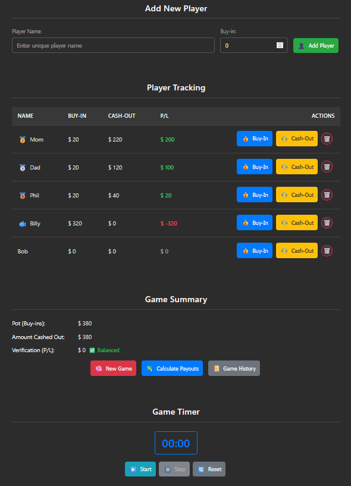
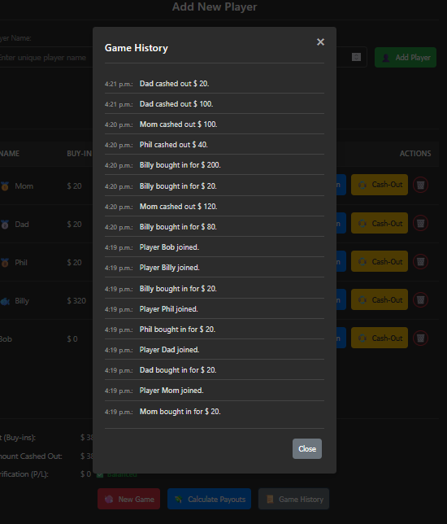
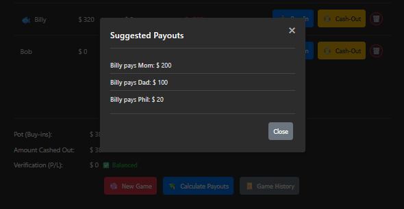

# Poker Manager 🃏

_A simple, static web application for tracking friendly poker games._

Keep track of buy-ins, cash-outs, player Profit/Loss (P/L), game history, and calculate suggested payouts—all within a single HTML file using your browser's Local Storage. Perfect for home games!

---

## ✨ Features

*   **👤 Player Management:** Easily add and remove players from the game session.
*   **💰 Buy-in & Cash-out Tracking:** Log initial buy-ins, subsequent buy-ins (re-buys/add-ons), and cash-outs for each player.
*   **📊 Real-time P/L Calculation:** Automatically calculates and displays each player's profit or loss throughout the game.
*   **🏆 Dynamic Ranking Emojis:** See 🥇, 🥈, 🥉 medals for top players and a 🐟 for the player with the biggest loss.
*   **📈 Game Summary:** View the total pot (sum of all buy-ins), total amount cashed out, and a verification check to ensure the game balances (P/L sums to zero).
*   **📜 Game History Log:** Access a detailed, timestamped log of all major game events (players joining, buy-ins, cash-outs, players removed) via a modal.
*   **💸 End-Game Payout Calculator:** Automatically calculates suggested player-to-player payments at the end of the game to settle debts efficiently.
*   **⏱️ Persistent Timer:** Includes a start/stop/reset timer (useful for blind levels) that persists across page refreshes using Local Storage.
*   **💾 Local Storage Persistence:** All player data, game history, timer state, and settings are saved directly in your browser's Local Storage, so your game state is preserved between sessions *on the same browser*.
*   **🎨 Settings & Customization:**
    *   **🌓 Dark/Light Mode:** Toggle between visual themes.
    *   **💲 Customizable Currency:** Select your preferred currency symbol ($, €, £, ¥, ₹).
*   **📱 Responsive Design:** Mobile-first design ensures usability on phones, tablets, and desktops.
*   **🔔 Toast Notifications:** Get subtle confirmations for actions like adding players, buy-ins, timer changes, etc.
*   **⌨️ Keyboard Friendly:** Add players quickly using the Enter key in the input fields.
*   **🚫 Safe Deletion:** Uses confirmation modals for critical actions like removing a player or starting a new game.
*   **📄 Single File Application:** Everything (HTML, CSS, JavaScript) is contained within one `.html` file for maximum portability.

---

## 🚀 Getting Started

1.  **Download:** Get the `poker_manager.html` file.
2.  **Logo (Optional but Recommended):** Download the `logo.svg` file and place it in the **same directory** as `poker_manager.html`.
3.  **Open:** Open the `poker_manager.html` file directly in your modern web browser (like Chrome, Firefox, Edge, Safari).

That's it! No installation or server required.

---

## 🛠️ How to Use

1.  **Add Players:** Enter a unique player name, optionally enter their initial buy-in amount (defaults to 0 if left blank), and click "Add Player" (or press Enter).
2.  **Track Actions:**
    *   Use the `💰 Buy-In` button in a player's row to log additional buy-ins via a pop-up modal. The input will remember the last entered buy-in amount.
    *   Use the `💱 Cash-Out` button to log the amount a player takes off the table.
    *   Use the `🗑️` button to remove a player (requires confirmation).
3.  **Monitor:** Keep an eye on the Player Tracking table for individual P/L and the Game Summary section for overall totals and balance verification.
4.  **Use Tools:**
    *   Start/Stop/Reset the **Game Timer** as needed.
    *   Click **Game History** in the summary section to see a log of events.
    *   Click **Calculate Payouts** to see suggested end-game transactions.
    *   Click the **Settings (⚙️)** icon in the top-right navbar to change the theme or currency symbol.
5.  **New Game:** Click the **New Game (🧼)** button (requires confirmation) to clear all current game data, history, and timer state to start fresh.

---

## 💻 Technology Stack

*   **HTML5:** Structure and content.
*   **CSS3:** Styling, layout (including Flexbox & CSS Grid for responsiveness), dark mode variables.
*   **JavaScript (ES6+):** DOM manipulation, event handling, calculations, Local Storage interaction, features implementation.
*   **Browser Local Storage:** For data persistence within the user's browser.

---

## ⚠️ Limitations

*   **Local Data Only:** All data is stored *exclusively* in the browser's Local Storage.
    *   Clearing your browser's data (cache, cookies, site data) **will permanently delete** your game data.
    *   Using a different browser, private/incognito mode, or a different device will not share the data.
*   **No Server/Backend:** This is a purely client-side application. There is no online synchronization or backup.
*   **No User Accounts:** Designed for single-session tracking on one device.
*   **Simple Payout Algorithm:** The payout calculation uses a basic greedy approach, which is correct but may not always result in the absolute minimum number of transactions compared to more complex algorithms.

---

## 🤝 Contributing (Optional)

Suggestions and bug reports are welcome! Please feel free to open an issue on the repository (if applicable) to discuss potential improvements or problems.

---

## 📜 License

This project is recommended to be licensed under the MIT License. You should create a `LICENSE` file in the repository containing the license text.

---

# Enjoy managing your poker nights! 🎉